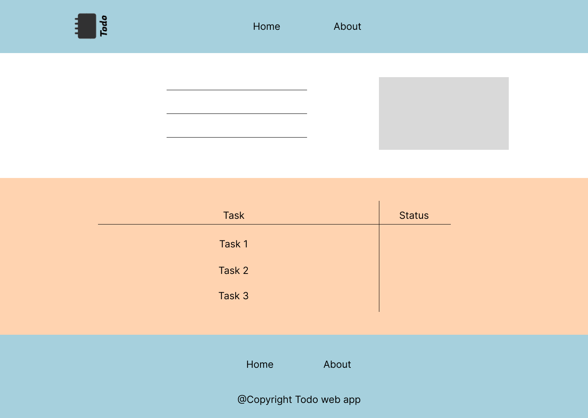
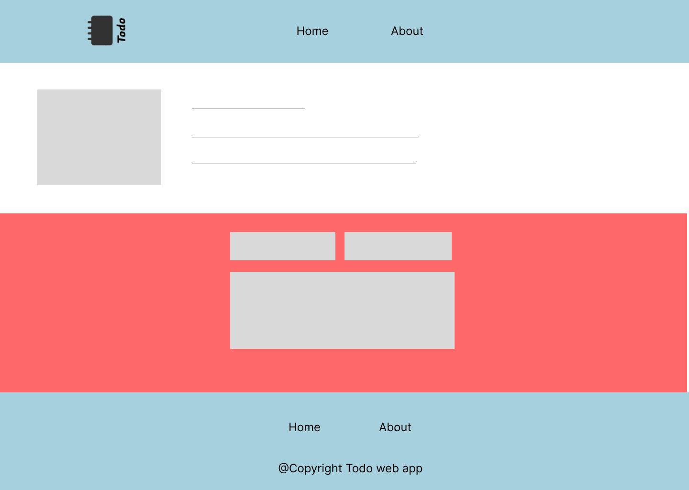

# todo-project

#### A todo project is where you can remember your daily tasks

---
at the first this desgin is not ready yet until we can deal with CSS

---

## Explaining Index.html

referring to the following wirefram .

 

 **At the top of the page we can find the header which has** .

> - Logo
> - Home tab (index.html)
> - About tab (about.html)

---

## Hero Section

- An image with some greeting and motivating words

---

## Table section

- A table which has 2 columns that describes task and status of each task whether it's done or not

---

## Footer

- Some links to navigate to other pages and a copyright policy :) .

---

## Explaining About.html

*** A header as the one in the homepage ***

my information with a picture of me at the left and name a some words of me.

---

## User Contact information

A form for the user to insert his name , email and a message to contact.
